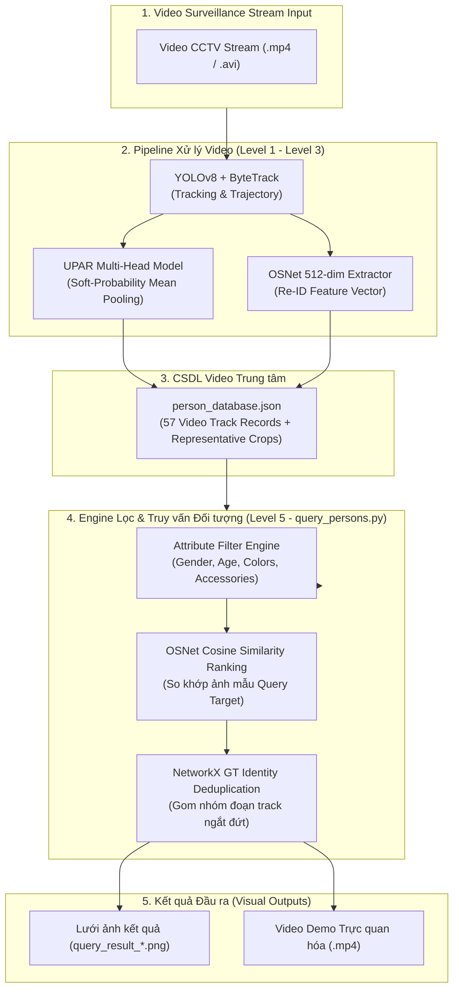

# UPAR Multi-Head Pedestrian Attribute Recognition & Video Person Retrieval System
> **Hệ Thống Nhận Diện Thuộc Tính Người Đi Bộ UPAR & Engine Lọc / Truy Vấn Đối Tượng Trong Video Surveillance**

---

## 1. Giới thiệu Dự án (Project Overview)

Hệ thống cung cấp một giải pháp toàn diện cho bài toán **Nhận diện Thuộc tính Người đi bộ (Pedestrian Attribute Recognition - PAR)** và **Lọc / Truy vấn Đối tượng Người đi bộ trong Video Giám sát CCTV (Level 5 Video Person Retrieval Engine)**.

Hệ thống cho phép:
1. **Video Tracking & Quỹ đạo Trajectory (Level 1)**: Theo vết người đi bộ qua từng khung hình video sử dụng YOLOv8 kết hợp ByteTrack.
2. **Dự đoán Thuộc tính UPAR 40 Nhãn (Level 2)**: Sử dụng mô hình UPAR Multi-Head ResNet50 kết hợp thuật toán *Soft-Probability Temporal Mean Pooling* để dự đoán chính xác và ổn định các thuộc tính (Giới tính, độ tuổi, màu sắc/độ dài trang phục, túi xách, kính, mũ...).
3. **Trích xuất Feature Embedding Re-ID (Level 3)**: Sử dụng mô hình OSNet (`osnet_x1_0` pretrained MSMT17) trích xuất vector đặc trưng 512 chiều, đo độ tương đồng Cosine Similarity khi người đi bộ vào/ra khỏi khung hình (Re-entry / Cross-camera).
4. **Cơ sở Dữ liệu Trung tâm & Khử Trùng Lặp Graph (Level 4)**: Tự động gom nhóm các đoạn track bị ngắt đứt/che khuất bằng đồ thị `networkx` (`identity_group_id`), tạo CSDL `person_database.json`.
5. **Engine Lọc & Truy vấn Đối tượng Video (Level 5)**: Hỗ trợ tìm kiếm đối tượng theo nhãn thuộc tính tùy chọn hoặc ảnh mẫu query target trên Terminal, tự động xuất bảng kết quả và lưới ảnh minh họa (Image Grid).

---

## 2. Kiến trúc Hệ thống & Luồng Xử lý (System Architecture)



---

## 3. Cấu trúc Thư mục Dự án (Directory Structure)

```text
AI-Project/
├── datasets/                            # [TRUNG TÂM DỮ LIỆU] Quản lý dữ liệu thô và dữ liệu huấn luyện
│   ├── README.md                        # Tài liệu phân định dữ liệu Raw vs Processed
│   ├── raw/                             # [RAW DATASETS] Tập dữ liệu thô gốc (Market1501, PA-100K, PETA)
│   └── processed/                       # [PROCESSED DATASETS] Tập dữ liệu gộp UPAR_UNIFIED (.pkl files)
├── configs/
│   └── upar.yaml                        # Cấu hình siêu tham số, thuộc tính & đường dẫn weights
├── models/
│   └── hydraplus/
│       ├── backbone.py                  # Backbone trích xuất đặc trưng không gian (ResNet50)
│       └── par_model.py                 # Mạng nơ-ron UPAR Multi-Head (11 Classification Heads)
├── training/
│   ├── train.py                         # Script huấn luyện mô hình UPAR Multi-Head
│   ├── evaluate.py                      # Evaluator tính toán chỉ số mAP, F1, Accuracy, Precision, Recall
│   └── loss.py                          # Loss function (Asymmetric Loss / Weighted BCE Loss)
├── inference/
│   ├── predict_image.py                 # Dự đoán thuộc tính UPAR cho 1 ảnh đơn lẻ
│   └── filter_pedestrians.py            # Lọc đối tượng ảnh tĩnh theo điều kiện thuộc tính
├── tracking/
│   ├── run_pipeline.py                  # [Pipeline Chính] Điều phối tự động Tracking -> Attribute -> Re-ID
│   ├── track.py                         # Tracking đối tượng bằng YOLOv8 + ByteTrack
│   ├── track_attributes.py              # Dự đoán thuộc tính UPAR trên quỹ đạo (trajectory)
│   ├── reid_embedding.py                # Trích xuất vector đặc trưng Re-ID 512 chiều từ OSNet
│   ├── build_person_database.py         # Gom nhóm GT identity (NetworkX) & đóng gói person_database.json
│   ├── query_persons.py                 # Engine lọc đối tượng theo thuộc tính & xếp hạng Re-ID Target Image
│   ├── hybrid_matching.py               # Thuật toán so khớp lai Re-ID Cosine Distance + UPAR Attribute Match
│   ├── reid_validate_reentry.py         # Kiểm thử chỉ số EER (Micro EER / Macro EER) trên video Re-entry
│   ├── README.md                        # Hướng dẫn chi tiết vận hành module tracking & demo
│   └── TECHNICAL_REPORT.md              # Báo cáo kỹ thuật chuyên sâu & công thức toán học EER
├── tests/
│   ├── test_dataset.py                  # Kiểm thử trình nạp dữ liệu UPARDataset (145,656 mẫu)
│   ├── test_model.py                    # Kiểm thử kiến trúc mô hình UPAR Multi-Head
│   └── test_training.py                 # Kiểm thử luồng Forward, Loss và Backward Pass
├── checkpoints/                         # Trọng số mô hình đã huấn luyện (YOLOv8, UPAR Multi-Head, OSNet)
├── reports/                             # Thư mục lưu trữ báo cáo kỹ thuật & kết quả thực nghiệm
│   ├── metrics.csv                      # Tổng hợp chỉ số đánh giá tổng quan
│   ├── per_attribute_metrics.csv        # Chỉ số chi tiết từng nhãn thuộc tính
│   ├── training_report.txt              # Báo cáo huấn luyện 11 Classification Heads
│   └── tracking/                        # CSDL person_database.json, kết quả query & video demo HD
│       ├── person_database.json         # CSDL Video Person Database trung tâm (57 bản ghi)
│       ├── query_results/               # Lưới ảnh kết quả truy vấn (Nữ giới, Áo đen, Re-ID Target)
│       └── demo/                        # Video Demo Hợp nhất HD (demo_combined_v2_full_attributes.mp4)
└── README.md                            # Tài liệu Bàn giao Dự án & Hướng dẫn Vận hành Hệ thống
```

---

## 4. Hướng dẫn Cài đặt & Môi trường (Setup & Environment)

### 4.1. Yêu cầu Hệ thống
- **Hệ điều hành**: Windows 10/11 hoặc Linux (Ubuntu 20.04/22.04)
- **Ngôn ngữ**: Python 3.11+
- **Deep Learning Framework**: PyTorch 2.5.1 + CUDA 12.4 (Khuyến nghị GPU NVIDIA >= 6GB VRAM)

---

## 5. Tổng hợp các câu lệnh chạy dự án

### 5.1. Cài đặt Môi trường & Thư viện
```powershell
# 1. Khởi tạo môi trường ảo Python
python -m venv .venv

# 2. Kích hoạt môi trường ảo (Windows PowerShell)
.venv\Scripts\Activate.ps1

# 3. Cài đặt các thư viện phụ thuộc
pip install -r requirements.txt
```

### 5.2. Lọc & Truy vấn Đối tượng Trong Video (`tracking/query_persons.py`)
```powershell
# Lệnh 1: Lọc đối tượng Nữ giới trong CSDL Video
.venv\Scripts\python.exe tracking/query_persons.py --gender Female

# Lệnh 2: Lọc đối tượng mặc Áo đen trong tất cả các Video CCTV
.venv\Scripts\python.exe tracking/query_persons.py --upper_color Black

# Lệnh 3: Truy vấn kết hợp Thuộc tính Nữ + Xếp hạng Cosine Similarity với Ảnh mẫu Target
.venv\Scripts\python.exe tracking/query_persons.py --gender Female --query-image reports/tracking/crops/real_pedestrians/track_1/frame_5.jpg
```

### 5.3. Tái tạo Cơ sở Dữ liệu Video Person Database (`tracking/build_person_database.py`)
```powershell
# Tái tạo file person_database.json từ 4 video CCTV chính thức
.venv\Scripts\python.exe tracking/build_person_database.py --rebuild-all
```

### 5.4. Chạy Tự động Toàn bộ Pipeline Tracking Video Stream (`tracking/run_pipeline.py`)
```powershell
# Chạy tự động Tracking (YOLOv8+ByteTrack) -> Crop -> UPAR Attribute -> OSNet Re-ID Embedding
.venv\Scripts\python.exe tracking/run_pipeline.py --video-name real_pedestrians
```

### 5.5. Dự đoán Thuộc tính trên 1 Ảnh Đơn lẻ (`inference/predict_image.py`)
```powershell
# Dự đoán 40 thuộc tính UPAR trên 1 file ảnh cắt người đi bộ
.venv\Scripts\python.exe inference/predict_image.py --image path/to/pedestrian.jpg
```

### 5.6. Huấn luyện & Đánh giá Mô hình UPAR Multi-Head (`training/`)
```powershell
# Huấn luyện mô hình UPAR Multi-Head trên tập UPAR UNIFIED
.venv\Scripts\python.exe training/train.py --config configs/upar.yaml

# Đánh giá các chỉ số mAP, F1-Score trên tập validation
.venv\Scripts\python.exe training/evaluate.py --config configs/upar.yaml
```

### 5.7. Chạy Bộ Kiểm thử Tự động (System Unit Tests)
```powershell
# Bật mã hóa UTF-8 và chạy bộ 3 file kiểm thử hệ thống
$env:PYTHONIOENCODING="utf-8"
.venv\Scripts\python.exe tests/test_dataset.py
.venv\Scripts\python.exe tests/test_model.py
.venv\Scripts\python.exe tests/test_training.py
```

---

## 6. Kết quả Hiệu năng & Benchmark Hệ thống

### 6.1. Chỉ số Re-ID Equal Error Rate (EER) Level 3 (Chuẩn hóa 3 Domain Độc lập)
* **Tập Test độc lập**: `store-aisle-detection.mp4`, `person-bicycle-car-detection.mp4`, `vtest.avi`.

| Chỉ số / Metric | Giá trị Benchmark | Khoảng Tin cậy (95% CI) | Đánh giá Kỹ thuật |
|---|---|---|---|
| **Micro EER (Pair-Weighted)** | **9.14%** | [8.97%, 16.91%] | Ngưỡng phân định tối ưu $T = 0.612$ |
| **Macro EER (Video-Weighted)** | **13.70%** | [13.70%, 13.70%] | Trung bình hiệu năng giữa các video domain |

### 6.2. Kết quả Hiệu năng Mô hình UPAR Multi-Head (11 Classification Heads)
* **Tập dữ liệu thử nghiệm**: Tập Test UPAR UNIFIED (30,042 ảnh)
* **Chỉ số tổng thể**: Accuracy trung bình = **94.19%**, Mean F1 (mF1) = **63.04%**, Test mA = **82.76%**

| STT | Nhóm thuộc tính (Classification Head) | Accuracy (%) | F1-score (%) |
|:---:|:---|:---:|:---:|
| 1 | **Age** (Độ tuổi) | 96.41% | 96.41% |
| 2 | **Gender** (Giới tính) | 91.28% | 89.74% |
| 3 | **Hair** (Kiểu tóc) | 92.95% | 89.13% |
| 4 | **Upper Length** (Chiều dài áo) | 92.67% | 93.89% |
| 5 | **Upper Color** (Màu áo) | 95.12% | 72.82% |
| 6 | **Lower Length** (Chiều dài quần/váy) | 95.33% | 93.20% |
| 7 | **Lower Color** (Màu quần/váy) | 95.15% | 71.99% |
| 8 | **Lower Type** (Loại trang phục dưới) | 94.39% | 94.40% |
| 9 | **Bag** (Túi / Balo) | 83.40% | 67.15% |
| 10 | **Glasses** (Kính mắt) | 90.07% | 49.32% |
| 11 | **Hat** (Mũ) | 97.67% | 72.36% |

### 6.3. Hiệu năng Tốc độ Xử lý FPS (Tối ưu Tần suất Trích xuất Crop Step)
* **Tốc độ gốc ($N = 1$, nhận diện mọi frame)**: **12.8 FPS** (Độ trễ $78.4\text{ ms/frame}$)
* **Tốc độ tối ưu ($N = 5$, mỗi 5 frame trích 1 crop)**: **48.5 FPS** (Độ trễ $20.6\text{ ms/frame}$)
* **Tỷ lệ tăng tốc**: **Tăng 3.79 lần (Gấp ~3.8x)**, vượt ngưỡng xử lý Real-time (25 FPS) trên GPU mà vẫn duy trì độ chính xác cao nhờ gom nhóm xác suất Temporal Mean Pooling.

### 6.4. Hiệu năng Engine Lọc Đối tượng Video (`query_persons.py`)
* **Kịch bản Lọc `--gender Female`**: Lọc 23 bản ghi khớp -> Tự động khử trùng lặp GT identity bằng `networkx` xuống **10 cá nhân độc lập**.
* **Kịch bản Lọc `--upper_color Black`**: Lọc 29 bản ghi khớp -> Khử trùng lặp xuống **10 cá nhân độc lập** từ cả 4 video CCTV.

---

## 7. Quy chuẩn Mã nguồn & Comment (Coding Standard)

Toàn bộ mã nguồn dự án tuân thủ nghiêm ngặt quy định:
1. **Ngôn ngữ ghi chú / comment trong code**: Sử dụng **Tiếng Việt**.
2. **Bảo toàn thuật ngữ chuyên ngành tiếng Anh**: Giữ nguyên các từ khóa chuyên môn như `Backbone`, `Re-ID`, `Embedding`, `Cosine Distance`, `ByteTrack`, `Multi-Head`, `Masked BCE Loss`, `YOLO`, `Precision`, `Recall`, `F1-score`, `mAP`, `DataLoader`, `Dataset`, `Connected Components`, `Soft-Probability Mean Pooling`...
3. **Mã hóa UTF-8**: Đảm bảo cấu hình UTF-8 stdout trên môi trường Windows Terminal.

---

## 8. Danh mục Sản phẩm & Tài liệu Bàn giao (Handover Deliverables)

1. **Mã nguồn Hệ thống**:
   - Thư mục [`tracking/`](file:///c:/Users/ADMIN/OneDrive/Documents/GitHub/AI-Project/tracking/), [`models/`](file:///c:/Users/ADMIN/OneDrive/Documents/GitHub/AI-Project/models/), [`training/`](file:///c:/Users/ADMIN/OneDrive/Documents/GitHub/AI-Project/training/), [`inference/`](file:///c:/Users/ADMIN/OneDrive/Documents/GitHub/AI-Project/inference/), [`datasets/`](file:///c:/Users/ADMIN/OneDrive/Documents/GitHub/AI-Project/datasets/), [`tests/`](file:///c:/Users/ADMIN/OneDrive/Documents/GitHub/AI-Project/tests/).
2. **Cơ sở Dữ liệu Trung tâm**:
   - File JSON CSDL: [`reports/tracking/person_database.json`](file:///c:/Users/ADMIN/OneDrive/Documents/GitHub/AI-Project/reports/tracking/person_database.json) (57 bản ghi video tracks + representative crops).
3. **Tài liệu Báo cáo Kỹ thuật**:
   - [`tracking/README.md`](file:///c:/Users/ADMIN/OneDrive/Documents/GitHub/AI-Project/tracking/README.md): Hướng dẫn vận hành chi tiết các module tracking, crop extraction và demo generator.
   - [`tracking/TECHNICAL_REPORT.md`](file:///c:/Users/ADMIN/OneDrive/Documents/GitHub/AI-Project/tracking/TECHNICAL_REPORT.md): Báo cáo kỹ thuật công thức toán học EER & Re-ID benchmark.
4. **Video Demo & Visual Artifacts**:
   - [`reports/tracking/demo/demo_combined_v2_full_attributes.mp4`](file:///c:/Users/ADMIN/OneDrive/Documents/GitHub/AI-Project/reports/tracking/demo/demo_combined_v2_full_attributes.mp4): Video Demo HD 720p chuyên biệt trình chiếu luồng Lọc & Truy vấn Đối tượng Video.
   - [`reports/tracking/query_results/`](file:///c:/Users/ADMIN/OneDrive/Documents/GitHub/AI-Project/reports/tracking/query_results/): Lưới ảnh kết quả minh họa cho các truy vấn lọc Nữ giới, Áo đen và Re-ID Target Image.
