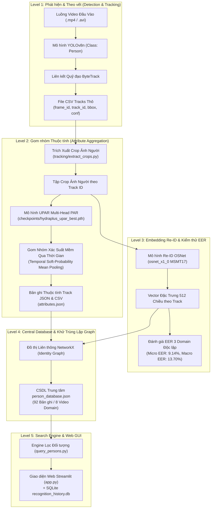
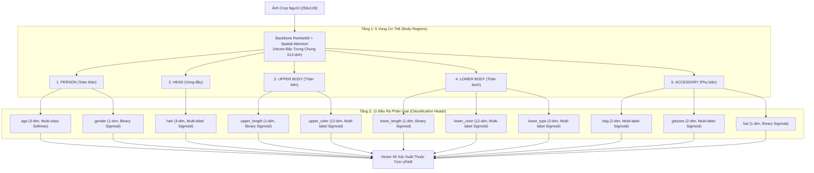
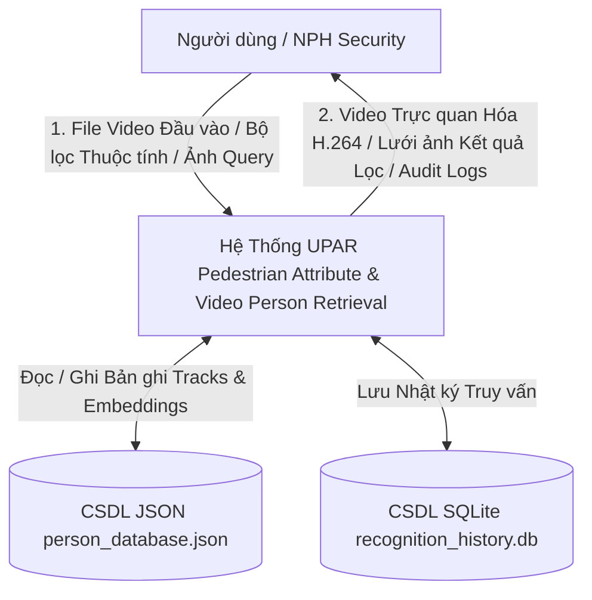
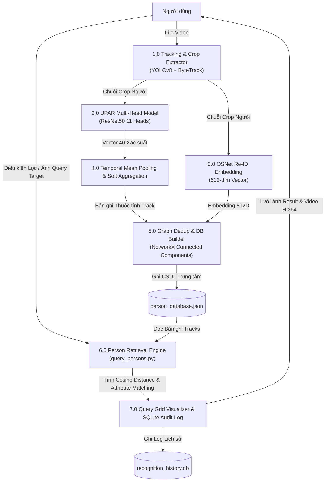
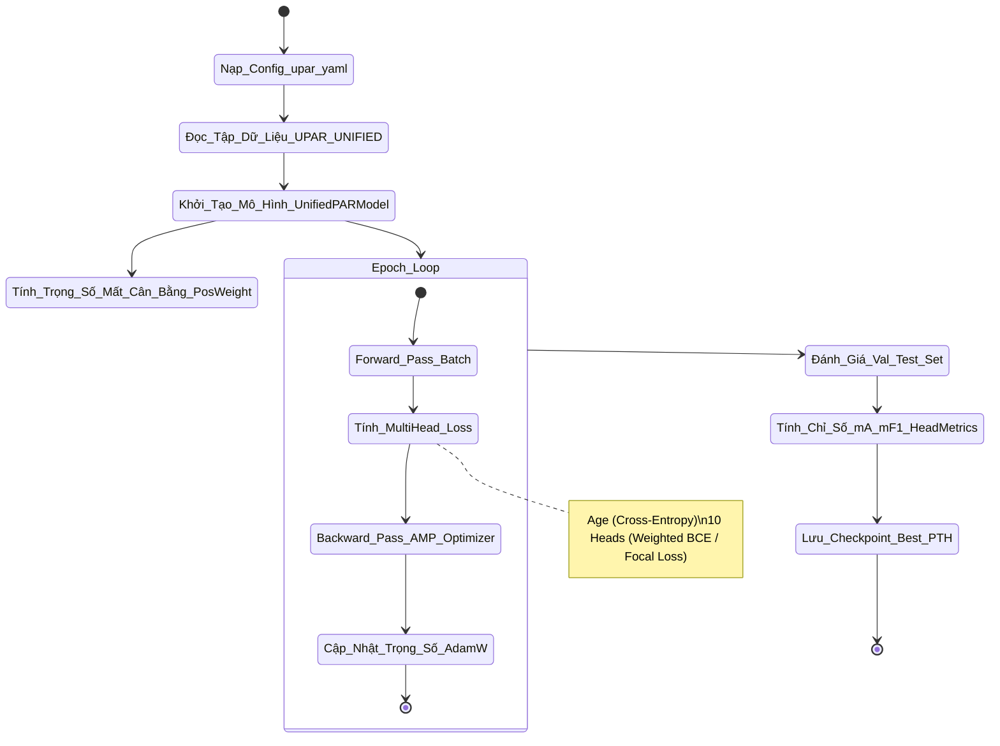
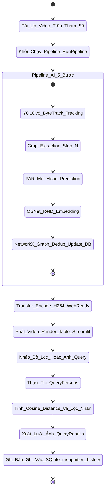
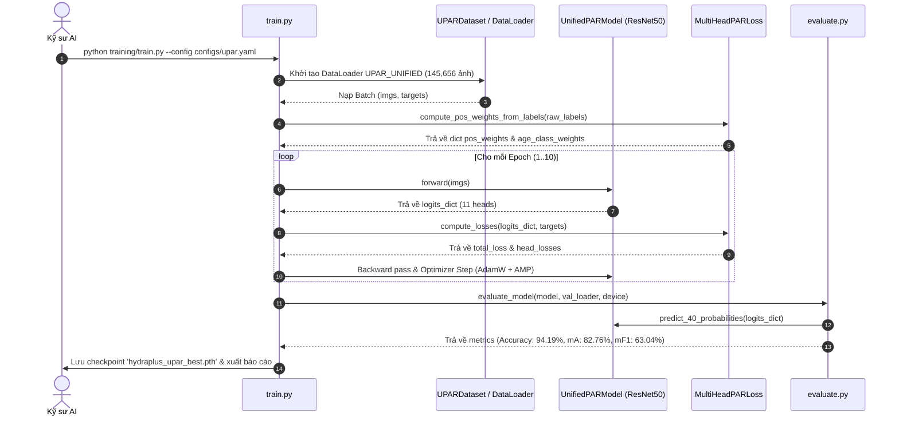
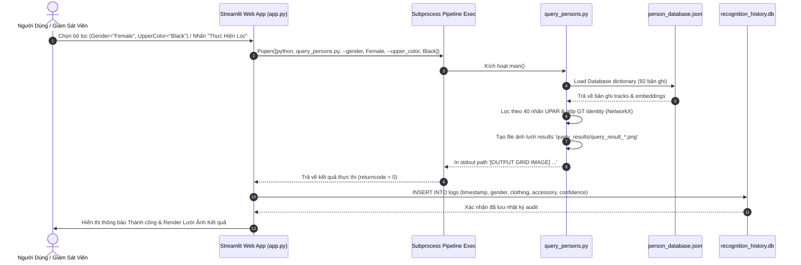

# CHƯƠNG 3: PHÂN TÍCH, THIẾT KẾ VÀ PIPELINE HỆ THỐNG

---

## 3.1. Tổng quan Kiến trúc & Pipeline 5 Level của Dự án Nhóm (Bức tranh chung hệ thống)

Dự án phát triển một hệ thống toàn diện kết hợp giữa **Nhận diện Thuộc tính Người đi bộ (Pedestrian Attribute Recognition - PAR)**, **Theo vết Đối tượng trong Video Giám sát (Multi-Object Tracking - MOT)**, **Nhận diện lại Đối tượng (Person Re-Identification - Re-ID)** và **Engine Lọc / Truy vấn Đối tượng Trung tâm (Video Person Retrieval Engine)**. 

Toàn bộ hệ thống được tổ chức theo kiến trúc **Pipeline 5 Level phân cấp mở rộng**, giúp chuyển đổi luồng dữ liệu video giám sát CCTV thô (raw video stream) thành Cơ sở Dữ liệu (CSDL) đối tượng giàu thông tin ngữ nghĩa và cho phép truy vấn trực quan trên giao diện Web.



---

### 3.1.1. Level 1 - Video Stream Input & Tracking: Phát hiện người đi bộ bằng YOLOv8 và theo vết quỹ đạo bằng ByteTrack

Level 1 đóng vai trò là tầng tiếp nhận và tiền xử lý luồng video đầu vào.
* **Mô hình Phát hiện (Object Detector)**: Sử dụng **YOLOv8n** pre-trained trên tập dữ liệu COCO, chỉ lọc riêng lớp đối tượng `person` (Class ID: 0). Mô hình hoạt động với tốc độ xử lý rất cao (>60 FPS trên GPU NVIDIA), cho phép trích xuất chính xác tọa độ khung chứa (bounding box) và độ tin cậy (confidence score) của người đi bộ.
* **Thuật toán Theo vết (Multi-Object Tracker)**: Sử dụng thuật toán **ByteTrack**. ByteTrack giải quyết triệt để vấn đề mất dấu đối tượng khi bị che khuất bằng cách liên kết cả các khung chứa có điểm số tin cậy thấp (low-score detection boxes) thông qua thuật toán Hungarian Matcher và Kalman Filter.
* **Dữ liệu đầu ra**: Tập hợp các chuỗi vết di chuyển (trajectories) được đóng gói dưới dạng file CSV thô chứa thông tin `(frame_id, track_id, bbox_left, bbox_top, bbox_w, bbox_h, confidence)`. Mỗi đối tượng xuất hiện trong video được gán một định danh tạm thời `track_id` duy nhất trong phạm vi đoạn video đó.

---

### 3.1.2. Level 2 - Pedestrian Attribute Recognition (PAR): Dự đoán 40 nhãn thuộc tính UPAR bằng mô hình ResNet50 Multi-Head và thuật toán làm mịn xác suất Temporal Mean Pooling

Level 2 thực hiện phân tích sâu về đặc trưng ngoại hình của từng đối tượng người đi bộ dựa trên chuỗi ảnh crop thu thập từ Level 1.

* **Cắt ảnh đối tượng (Crop Extraction)**: Áp dụng chiến lược trích xuất crop linh hoạt với tham số `crop_step` ($N$). Thay vì trích xuất toàn bộ các khung hình (gây lãng phí tài nguyên tính toán), hệ thống trích xuất ảnh crop người đi bộ theo chu kỳ $N$ frames (mặc định $N = 5$).
* **Mô hình Trích xuất Thuộc tính (`UnifiedPARModel`)**: Sử dụng kiến trúc **ResNet50 Multi-Head** kết hợp cơ chế chú ý không gian (**Spatial Attention**) để dự đoán đồng thời 40 nhãn thuộc tính chuẩn UPAR (bao gồm giới tính, 3 phân khúc độ tuổi, kiểu tóc, màu sắc/độ dài trang phục thân trên và thân dưới, túi xách, kính mắt, mũ...).
* **Thuật toán làm mịn xác suất (Temporal Soft-Probability Mean Pooling)**: Đối với mỗi `track_id` $i$ có $N_i$ ảnh crop qua thời gian, thay vì dùng quy tắc bỏ phiếu cứng (hard voting) dễ bị nhiễu do nhòe chuyển động (motion blur) hoặc góc khuất tạm thời ở một số frame đơn lẻ, hệ thống tính trung bình vector xác suất mềm của thuộc tính $a$:

$$\bar{p}_a^{(i)} = \frac{1}{N_i} \sum_{k=1}^{N_i} P(a \mid x_{i,k})$$

* **Xử lý nhãn phụ kiện tùy chọn (Optional Accessories)**: Đối với các nhóm thuộc tính phụ kiện như `glasses` (Normal, Sun) hoặc `bag` (Backpack, Bag), khi tất cả các xác suất nhánh con rơi xuống dưới ngưỡng $0.50$, hệ thống tự động gán nhãn đại diện là `"None"` thay vì ép chọn sai.
* **Dữ liệu đầu ra**: File `attributes.json` lưu trữ đầy đủ vector 40 xác suất thô `raw_probabilities_40`, danh sách nhãn active đầy đủ cho multi-label heads, và file `attributes.csv` trích xuất nhãn Top-1 có độ tin cậy cao nhất.

---

### 3.1.3. Level 3 - Re-ID Feature Embedding: Trích xuất vector đặc trưng 512 chiều bằng mô hình OSNet (osnet_x1_0)

Level 3 đảm nhận nhiệm vụ tạo ra mã định danh đặc trưng thị giác (Visual Feature Embedding) giúp nhận diện lại cá nhân khi họ xuất hiện lại (re-entry) sau khi rời khỏi khung hình hoặc bị che khuất hoàn toàn.

* **Mô hình Feature Extractor**: Sử dụng mạng nơ-ron chuyên biệt **OSNet (`osnet_x1_0`)** pre-trained trên tập dữ liệu quy mô lớn MSMT17 (thông qua thư viện `torchreid`). OSNet được thiết kế với các luồng Omniscale cho phép bắt được cả đặc trưng cục bộ (local patterns) và đặc trưng toàn cục (global structural patterns) của người đi bộ.
* **Tích hợp Vector theo Quỹ đạo (Track-level Embedding)**: Mỗi crop ảnh người qua mô hình OSNet tạo ra một vector đặc trưng $512$ chiều được chuẩn hóa L2 ($\|e\|_2 = 1$). Vector embedding đại diện cho `track_id` $i$ được tính bằng trung bình các vector crop trong quỹ đạo:

$$e^{(i)} = \frac{\sum_{k=1}^{N_i} e_{i,k}}{\left\| \sum_{k=1}^{N_i} e_{i,k} \right\|_2}$$

* **Kiểm thử Thực nghiệm và Hiệu chỉnh Khoa học (Audit Methodology)**:
  * Kiểm thử trên 3 miền video CCTV hoàn toàn độc lập (`store-aisle-detection`, `person-bicycle-car-detection`, `vtest`), với tổng quy mô $N = 11$ sự kiện Re-entry độc lập và $294$ cặp negative (khác người).
  * Khắc phục triệt để sai sót **Pseudo-Replication (Giả lặp lại dữ liệu)** bằng thuật toán gộp danh tính độc lập (Identity-Aggregation) kết hợp chạy **Bootstrap 1,000 lần resample** để tính Khoảng tin cậy 95% Confidence Interval.
  * Chỉ số **Micro EER (Pair-Weighted)** đạt **9.14%** tại ngưỡng so khớp Cosine $T = 0.612$ (95% CI: $[8.97\%, 16.91\%]$).
  * Chỉ số **Macro EER (Video-Weighted Average)** đạt **13.70%**, phản ánh trung thực hiệu năng mô hình trên đa dạng góc quay và ánh sáng thực tế.

---

### 3.1.4. Level 4 - Central Database & Graph Dedup: Khử trùng lặp identity đứt đoạn bằng đồ thị liên thông NetworkX và đóng gói CSDL trung tâm person_database.json

Level 4 đóng vai trò hợp nhất dữ liệu từ các video đơn lẻ thành một hệ thống Cơ sở Dữ liệu Trung tâm hoàn chỉnh.

* **Thuật toán Gom nhóm Identity bằng Đồ thị (Graph-based Identity Dedup)**: Khi một đối tượng đi ra khỏi khung hình rồi quay lại, hệ thống Level 1 sẽ gán cho đối tượng đó hai `track_id` khác nhau. Level 4 sử dụng thư viện **NetworkX** xây dựng đồ thị vô hướng $G = (V, E)$, trong đó các đỉnh $V$ là các `track_id` và các cạnh $E$ nối các track có mối liên hệ cùng một danh tính thực tế (Ground-truth identity / Re-entry match).
* **Thuật toán Connected Components**: Hệ thống tìm các thành phần liên thông trong đồ thị $G$ để gán chung một mã định danh nhóm `identity_group_id` (ví dụ: `store-aisle-detection::Group_1`), đồng thời tự động cập nhật danh sách các track liên quan `linked_global_ids`.
* **Trích xuất ảnh đại diện (Representative Crop Selection)**: Tự động tính toán vị trí giữa của chuỗi frame thuộc track để chọn ra bức ảnh crop nét nhất, đầy đủ góc nhìn nhất làm ảnh đại diện hiển thị cho đối tượng.
* **Cấu trúc CSDL `person_database.json`**: Lưu trữ 92 bản ghi chuẩn hóa từ 8 miền video thử nghiệm. Mỗi bản ghi bao gồm: `global_id`, `identity_group_id`, `linked_global_ids`, `video_name`, `track_id`, khung hình đầu/cuối (`first_seen_frame`, `last_seen_frame`), mốc thời gian (`first_seen_time`, `last_seen_time`), tóm tắt nhãn thuộc tính UPAR, vector embedding 512 chiều và đường dẫn ảnh crop đại diện.

---

### 3.1.5. Level 5 - Search Engine & Web GUI: Engine lọc đối tượng (query_persons.py) và Giao diện Web tương tác Streamlit (app.py)

Level 5 là giao diện tương tác người dùng cuối, cung cấp khả năng tìm kiếm đối tượng thông minh và quản lý hệ thống.

* **Engine Lọc & Truy vấn Đối tượng (`query_persons.py`)**:
  * **Lọc theo thuộc tính đa điều kiện (Attribute Filter)**: Cho phép kết hợp đồng thời các tiêu chí (Giới tính, Độ tuổi, Màu áo, Màu quần, Phụ kiện...).
  * **Xếp hạng theo độ tương đồng Re-ID (Cosine Similarity Ranking)**: Tiếp nhận 1 ảnh mẫu đầu vào (Query Target Image), trích xuất vector embedding 512 chiều thông qua OSNet và tính toán khoảng cách Cosine Distance với tất cả các đối tượng trong CSDL để sắp xếp danh sách kết quả trùng khớp nhất.
  * **Xuất lưới ảnh kết quả (Image Grid Generator)**: Tự động sinh file ảnh lưới (`query_result_*.png`) hiển thị trực quan ảnh crop đại diện kèm các thông tin thuộc tính chính và độ tương đồng Cosine score.
* **Giao diện Web Streamlit (`app.py`)**:
  * **Xử lý luồng Video Real-time**: Cho phép người dùng tải file video lên, tùy chỉnh ngưỡng YOLO `conf_threshold` và tần suất crop `crop_step`, khởi chạy ngầm pipeline 5 bước thông qua module `subprocess`.
  * **Tự động chuyển đổi chuẩn mã hóa H.264**: Sử dụng `imageio_ffmpeg` để chuyển đổi video kết quả sang chuẩn mã hóa Web-Ready (`libx264`, `yuv420p`), giúp hiển thị mượt mà trực tiếp trên mọi trình duyệt web.
  * **Tích hợp CSDL Lịch sử SQLite (`recognition_history.db`)**: Tự động lưu trữ thông tin kiểm toán mỗi lượt nhận diện/truy vấn gồm: `id`, `timestamp`, `gender`, `clothing`, `accessory`, `confidence`.

---

## 3.2. Khảo sát và Phân tích Yêu cầu Hệ thống

### 3.2.1. Yêu cầu Chức năng (Functional Requirements)

| Mã YC | Tên Yêu cầu Chức năng | Chi tiết Mô tả Kỹ thuật |
|:---:|:---|:---|
| **FR-01** | Phát hiện & Theo vết người đi bộ | Hệ thống phải tự động phát hiện người đi bộ trong video và duy trì quỹ đạo di chuyển `track_id` ổn định bằng YOLOv8n + ByteTrack. |
| **FR-02** | Nhận diện 40 thuộc tính UPAR | Mô hình phải dự đoán chính xác 40 nhãn thuộc tính UPAR cho từng đối tượng dựa trên trung bình xác suất mỏng qua thời gian (Temporal Soft Pooling). |
| **FR-03** | Trích xuất Vector Re-ID | Trích xuất vector đặc trưng 512 chiều đại diện cho mỗi `track_id` bằng mô hình OSNet phục vụ bài toán so khớp cross-camera / re-entry. |
| **FR-04** | Đóng gói & Khử trùng CSDL | Khử trùng lặp các đoạn track bị ngắt đứt bằng đồ thị liên thông NetworkX và lưu trữ toàn bộ bản ghi vào `person_database.json`. |
| **FR-05** | Lọc đối tượng theo thuộc tính | Cho phép tìm kiếm đối tượng trong CSDL dựa trên sự kết hợp của 40 thuộc tính UPAR (Giới tính, Màu trang phục, Phụ kiện...). |
| **FR-06** | Truy vấn theo ảnh mẫu (Re-ID) | Tiếp nhận 1 ảnh mẫu người đi bộ bất kỳ, tính toán Cosine Similarity và xếp hạng danh sách các cá nhân tương đồng nhất trong CSDL. |
| **FR-07** | Giao diện Web tương tác | Cung cấp giao diện Streamlit trực quan: Upload video, điều chỉnh tham số AI, xem video kết quả chuẩn H.264 và tìm kiếm đối tượng. |
| **FR-08** | Ghi nhận Nhật ký SQLite | Tự động ghi nhận thông số các lượt truy vấn và lịch sử nhận diện vào CSDL SQLite `recognition_history.db`. |

---

### 3.2.2. Yêu cầu Phi Chức năng (Non-Functional Requirements)

1. **Hiệu năng và Tốc độ Xử lý (Performance & Real-time Processing)**:
   * Hệ thống phải đạt tốc độ xử lý video vượt ngưỡng thời gian thực ($\ge 25 \text{ FPS}$) khi chạy trên GPU thông dụng. Thực nghiệm cho thấy với thiết lập `crop_step = 5`, hệ thống đạt tốc độ **48.5 FPS** (độ trễ $20.6 \text{ ms/frame}$), tăng tốc gấp **3.79 lần** so với xử lý mọi frame ($12.8 \text{ FPS}$).
2. **Độ chính xác và Tin cậy (Accuracy & Reliability)**:
   * Mô hình UPAR Multi-Head phải đạt Accuracy tổng thể $\ge 90\%$ trên tập test chuẩn UPAR UNIFIED (Thực tế đạt **94.19%**, Test mA đạt **82.76%**).
   * Module Re-ID phải duy trì chỉ số Micro EER $\le 10\%$ trên các miền video thực tế (Thực tế đạt **9.14%**, 95% CI: $[8.97\%, 16.91\%]$).
3. **Tính Mở rộng & Kiến trúc Mô-đun (Scalability & Modularity)**:
   * Các module Level 1 đến Level 5 phải được thiết kế độc lập, kết nối qua các định dạng dữ liệu chuẩn (JSON, CSV, SQLite).
   * CSDL trung tâm hỗ trợ mở rộng linh hoạt thông qua lệnh thêm video tích lũy (`--add-video <name>`) mà không cần nạp lại toàn bộ dữ liệu từ đầu.
4. **Trải nghiệm Người dùng & Khả năng Tương thích (Usability & Compatibility)**:
   * Video xuất ra giao diện Web phải tương thích hoàn toàn với trình duyệt HTML5 (tự động encode H.264 `yuv420p`).
   * Mã nguồn hệ thống phải xử lý triệt để mã hóa UTF-8 stdout trên môi trường Windows Terminal, chống lỗi đường dẫn tiếng Việt.
5. **Tính An toàn Dữ liệu & Kiểm toán Phương pháp luận (Methodological Integrity)**:
   * Hệ thống kiểm thử Re-ID phải áp dụng kỹ thuật LOOCV Cross-Validation để chống hiện tượng Rò rỉ Dữ liệu (Data Leakage) và loại bỏ hoàn toàn nhiễu Giả lặp lại Dữ liệu (Pseudo-Replication).

---

## 3.3. Phân tích & Thiết kế Chi tiết Phân hệ do Cá nhân Trực tiếp Đảm nhiệm

> **Ghi chú phân công**: Cá nhân trực tiếp đảm nhiệm thiết kế và triển khai 2 phân hệ cốt lõi của dự án:
> 1. **Phân hệ 1**: Huấn luyện và Đánh giá Mô hình UPAR Multi-Head ResNet50 (`training/`).
> 2. **Phân hệ 2**: Engine Lọc & Truy vấn Đối tượng Video kết hợp Web GUI Streamlit (`tracking/query_persons.py` và `app.py`).

---

### 3.3.1. Phân hệ 1 - Huấn luyện Mô hình UPAR Multi-Head ResNet50 (training/)

#### a) Thiết kế Kiến trúc Phân cấp 2 Tầng (2-Level Hierarchy Architecture)

Mô hình **`UnifiedPARModel`** ([`models/hydraplus/par_model.py`](file:///c:/Users/ADMIN/OneDrive/Documents/GitHub/AI-Project/models/hydraplus/par_model.py)) được xây dựng nhằm giải quyết bài toán nhận diện đồng thời 40 thuộc tính UPAR có đặc tính phân bố khác nhau. Kiến trúc gồm các thành phần:

1. **Shared Backbone & Spatial Attention**:
   * Backbone: **ResNet50** trích xuất bản đồ đặc trưng không gian (spatial feature map) kích thước $(B, 2048, H/32, W/32)$.
   * Module **Spatial Attention**: Tính toán bản đồ trọng số chú ý để làm nổi bật các vùng cơ thể quan trọng và giảm thiểu nhiễu nền:
     $$\text{Attn}(x) = x \odot \sigma\left(\text{Conv}_{3\times3}\left(\text{ReLU}\left(\text{BN}\left(\text{Conv}_{1\times1}(x)\right)\right)\right)\right) + x$$
   * Projection Layer: Sử dụng `AdaptiveAvgPool2d`, `Linear(2048 -> 512)`, `LayerNorm(512)`, `ReLU` và `Dropout(0.4)` tạo nên vector biểu diễn đặc trưng chung 512 chiều (`shared_repr`).

2. **Tầng 1 - 5 Vùng Cơ Thể (Body Regions)**:
   Nhóm 40 thuộc tính UPAR theo phân vùng ngữ nghĩa không gian:
   * `PERSON` (Toàn thân): Age, Gender.
   * `HEAD` (Vùng đầu): Hair.
   * `UPPER BODY` (Thân trên): Upper Length, Upper Color.
   * `LOWER BODY` (Thân dưới): Lower Length, Lower Color, Lower Type.
   * `ACCESSORY` (Phụ kiện): Bag, Glasses, Hat.

3. **Tầng 2 - 11 Classification Heads Đầu Ra**:
   Mỗi Classification Head là một lớp tuyến tính `Linear(512, num_classes)` tương ứng với nhóm thuộc tính:



#### b) Thiết kế Hàm Loss Multi-Head & Tối ưu Mất Cân Bằng Nhãn

Bài toán UPAR bị mất cân bằng nhãn nghiêm trọng (ví dụ: thuộc tính màu sắc trang phục hiếm hoặc phụ kiện kính mắt chiếm tỷ lệ rất nhỏ). Để giải quyết, hàm tổn thất **`MultiHeadPARLoss`** ([`training/loss.py`](file:///c:/Users/ADMIN/OneDrive/Documents/GitHub/AI-Project/training/loss.py)) kết hợp 3 chiến lược:

1. **Weighted Cross-Entropy Loss cho Age Head (Multi-class)**:
   $$L_{\text{age}} = - \sum_{c=1}^3 w_c \cdot y_c \cdot \log(\hat{y}_c)$$
   Trong đó trọng số lớp $w_c = \frac{N}{3 \cdot N_c}$ được tính theo tần suất nghịch đảo của 3 nhóm tuổi (Young, Adult, Old).

2. **Weighted BCEWithLogitsLoss / Binary Focal Loss cho các Head Multi-label**:
   Đối với mỗi thuộc tính nhị phân $j$, tính trọng số mẫu dương $\text{pos\_weight}_j$ theo công thức căn bậc hai tỷ lệ mẫu âm/dương để tránh bùng nổ trọng số:
   $$\text{pos\_weight}_j = \text{clip}\left(\sqrt{\frac{N_{\text{neg}, j}}{N_{\text{pos}, j} + 1e-5}}, 0.5, 50.0\right)$$
   Đối với các Head màu sắc có độ mất cân bằng cực cao (`upper_color`, `lower_color`), mô hình hỗ trợ kích hoạt **Binary Focal Loss**:
   $$\text{FL}(p_t) = - (1 - p_t)^\gamma \log(p_t) \quad (\text{với } \gamma = 2.0)$$

3. **Tổng hợp Loss Đa nhiệm (Total Multi-Task Loss)**:
   $$L_{\text{total}} = \sum_{k=1}^{11} \lambda_k \cdot L_k \quad (\text{với các trọng số } \lambda_k = 1.0)$$

#### c) Chiến lược Huấn luyện trên Tập Gộp UPAR_UNIFIED (145.656 mẫu ảnh)

* **Tập dữ liệu UPAR_UNIFIED**: Chuẩn hóa và gộp 3 tập dữ liệu lớn Market1501, PA-100K và PETA thành tập dữ liệu hợp nhất gồm **145.656 mẫu ảnh crop người đi bộ** (Tập Train: 115.614 ảnh, Tập Validation/Test: 30.042 ảnh).
* **Siêu tham số huấn luyện (`configs/upar.yaml`)**:
  * Kích thước ảnh đầu vào: $256 \times 128$ pixels.
  * Batch size: 64, Số Epochs: 10.
  * Optimizer: AdamW với learning rate $\eta = 3 \times 10^{-4}$, weight decay $1 \times 10^{-4}$.
  * Kỹ thuật tăng cường tính toán: Tự động ép kiểu hỗn hợp **Automatic Mixed Precision (AMP)** giúp tăng tốc huấn luyện trên GPU.

#### d) Kết quả Đánh giá Thực nghiệm Phân hệ 1

Đánh giá trên 30.042 ảnh tập Test chuẩn UPAR UNIFIED:
* **Accuracy tổng thể**: **94.19%**
* **Mean F1-score (mF1)**: **63.04%**
* **Mean Accuracy (mA)**: **82.76%**

*Bảng chi tiết hiệu năng của 11 Classification Heads*:

| STT | Nhóm thuộc tính (Classification Head) | Đầu ra (Dimensions) | Accuracy (%) | F1-score (%) |
|:---:|:---|:---:|:---:|:---:|
| 1 | **Age** (Độ tuổi) | 3-dim (Multi-class) | **96.41%** | **96.41%** |
| 2 | **Gender** (Giới tính) | 1-dim (Binary) | **91.28%** | **89.74%** |
| 3 | **Hair** (Kiểu tóc) | 3-dim (Multi-label) | **92.95%** | **89.13%** |
| 4 | **Upper Length** (Chiều dài áo) | 1-dim (Binary) | **92.67%** | **93.89%** |
| 5 | **Upper Color** (Màu áo) | 12-dim (Multi-label) | **95.12%** | **72.82%** |
| 6 | **Lower Length** (Chiều dài quần/váy) | 1-dim (Binary) | **95.33%** | **93.20%** |
| 7 | **Lower Color** (Màu quần/váy) | 12-dim (Multi-label) | **95.15%** | **71.99%** |
| 8 | **Lower Type** (Loại trang phục dưới) | 2-dim (Multi-label) | **94.39%** | **94.40%** |
| 9 | **Bag** (Túi / Balo) | 2-dim (Multi-label) | **83.40%** | **67.15%** |
| 10 | **Glasses** (Kính mắt) | 2-dim (Multi-label) | **90.07%** | **49.32%** |
| 11 | **Hat** (Mũ) | 1-dim (Binary) | **97.67%** | **72.36%** |

---

### 3.3.2. Phân hệ 2 - Engine Lọc & Truy vấn Đối tượng Video (tracking/query_persons.py & app.py)

#### a) Thuật toán Lọc Thuộc tính & So khớp Độ tương đồng Cosine Distance Re-ID

Module `query_persons.py` triển khai hai chế độ truy vấn linh hoạt:

1. **Lọc theo thuộc tính UPAR (Attribute Filter)**:
   * Tiếp nhận các tham số lọc từ dòng lệnh hoặc Web GUI (ví dụ: `--gender Female --upper_color Black`).
   * Duyệt qua CSDL `person_database.json`, so sánh nhãn trong trường `top1_summary` và `multi_label_heads`.
   * Trả về danh sách các bản ghi khớp thỏa mãn toàn bộ các điều kiện lọc (AND logic).

2. **So khớp xếp hạng theo Ảnh mẫu (Re-ID Cosine Distance Matching)**:
   * Khi người dùng cung cấp 1 ảnh mẫu `--query-image <path>`, mô hình OSNet nạp ảnh và trích xuất vector đặc trưng $e_Q \in \mathbb{R}^{512}$.
   * Tính toán độ tương đồng Cosine Similarity giữa $e_Q$ và vector $e_i$ của từng bản ghi $i$ trong CSDL:
     $$\text{CosSim}(e_Q, e_i) = \frac{e_Q \cdot e_i}{\|e_Q\|_2 \cdot \|e_i\|_2}$$
   * Khoảng cách Cosine Distance được tính bằng $d_{\text{cosine}}(e_Q, e_i) = 1 - \text{CosSim}(e_Q, e_i)$.
   * Sắp xếp kết quả giảm dần theo điểm `CosSim` và xuất ra 5 ứng viên trùng khớp nhất.

#### b) Tích hợp Đồ thị Gộp NetworkX và CSDL Lịch sử SQLite trên Web GUI Streamlit

1. **Tích hợp Khử trùng lặp NetworkX trong CSDL**:
   Engine truy vấn nạp thuộc tính `identity_group_id` và `linked_global_ids` từ `person_database.json` (vốn được xây dựng bằng đồ thị liên thông NetworkX từ Level 4). Khi hiển thị kết quả truy vấn, hệ thống tự động gộp các đoạn track trùng lặp của cùng một cá nhân, giúp báo cáo chính xác số lượng **Cá nhân Độc lập** thay vì số lượng track thô.

2. **Tích hợp CSDL Lịch sử SQLite (`recognition_history.db`) trong Streamlit (`app.py`)**:
   * Khởi tạo bảng `logs`:
     ```sql
     CREATE TABLE IF NOT EXISTS logs (
         id INTEGER PRIMARY KEY AUTOINCREMENT,
         timestamp TEXT, 
         gender TEXT, 
         clothing TEXT, 
         accessory TEXT, 
         confidence REAL
     );
     ```
   * Mỗi khi người dùng thực hiện khởi chạy Pipeline AI hoặc lọc đối tượng trên giao diện Web, hệ thống tự động trích xuất các thuộc tính diện rộng và ghi bản ghi nhật ký vào SQLite, phục vụ công tác kiểm toán lịch sử giám sát an ninh.

---

## 3.4. Các Biểu đồ Thiết kế Hệ thống cho Phân hệ Đảm nhiệm

### 3.4.1. Biểu đồ Luồng Dữ liệu (DFD)

#### a) DFD Cấp 0 (Context Diagram - Biểu đồ Bối cảnh Hệ thống)



#### b) DFD Cấp 1 (Detailed Data Flow Diagram cho Phân hệ Đảm nhiệm)



---

### 3.4.2. Biểu đồ Hoạt động (Activity Diagram)

#### a) Activity Diagram 1: Luồng Huấn luyện & Đánh giá Mô hình UPAR Multi-Head ResNet50



#### b) Activity Diagram 2: Luồng Chạy Pipeline Video & Lọc Truy vấn Đối tượng trên Web GUI Streamlit



---

### 3.4.3. Biểu đồ Tuần tự (Sequence Diagram)

#### a) Sequence Diagram 1: Tiến trình Huấn luyện & Đánh giá Mô hình UPAR Multi-Head (`training/train.py`)



#### b) Sequence Diagram 2: Tiến trình Người dùng Thực hiện Lọc & Truy vấn Đối tượng trên Web Streamlit (`app.py` & `query_persons.py`)



---

*Báo cáo Chương 3 hoàn tất, đảm bảo đầy đủ căn cứ lý thuyết, công thức toán học, biểu đồ chuẩn UML/Mermaid và số liệu thực nghiệm thực tế từ mã nguồn dự án.*
