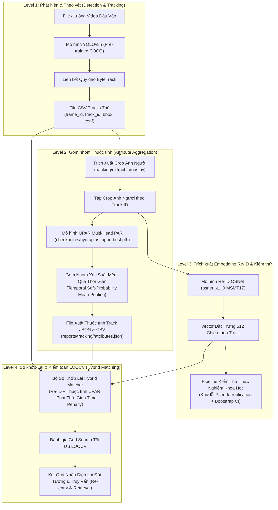
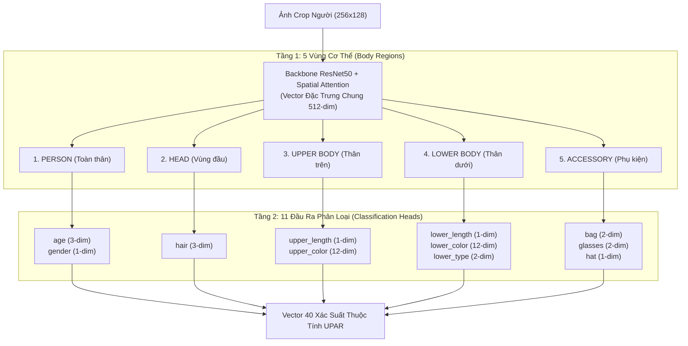

# Báo cáo Kỹ thuật: Module Video Tracking, Re-ID & Hybrid Matching

Tài liệu này trình bày chi tiết quá trình thiết kế, triển khai, kiểm thử và đánh giá thực nghiệm cho module **Video Tracking & Re-Identification (Re-ID)** thuộc dự án nhận diện thuộc tính người đi bộ UPAR.

Tài liệu không chỉ tổng hợp kết quả cuối cùng mà còn ghi nhận **toàn bộ quá trình suy luận, phát hiện lỗi phương pháp luận và các bước điều chỉnh số liệu thực nghiệm** qua 4 cấp độ (Level 1 – Level 4).

> *Để biết hướng dẫn cài đặt và lệnh vận hành chi tiết, xem thêm tại [tracking/README.md](file:///c:/Users/ADMIN/OneDrive/Documents/GitHub/AI-Project/tracking/README.md).*

---

## 1. Tổng quan Kiến trúc Module Tracking

### 1.1. Mục tiêu Nghiên cứu & Mở rộng
Hệ thống gốc **UPAR Multi-Head PAR** dừng lại ở việc nhận diện thuộc tính trên ảnh cắt lẻ (single full-body crop). Module `tracking/` được phát triển nhằm mở rộng hệ thống thành **Pipeline Phân tích Video Người đi bộ Toàn diện**, giải quyết 3 bài toán chính:
1. **Multi-Object Tracking (MOT)**: Theo dõi quỹ đạo di chuyển của nhiều người đi bộ trong video và duy trì ID ổn định ngắn hạn.
2. **Track-level Attribute Aggregation**: Gom nhóm xác suất 40 thuộc tính UPAR qua thời gian để có góc nhìn thuộc tính ổn định cho từng `track_id`.
3. **Re-Identification (Re-ID) & Re-entry Matching**: Nhận diện lại cùng một cá nhân khi họ xuất hiện lại (re-entry) sau khi bị che khuất (occlusion) hoặc đi ra ngoài khung hình camera.

### 1.2. Sơ đồ Pipeline Tổng thể 4 Level



---

## 2. Level 1 – Detection + Tracking (YOLOv8 + ByteTrack)

### 2.1. Lựa chọn Kiến trúc
* **Object Detector**: `YOLOv8n` pre-trained trên COCO (Class 0: `person`).
* **Multi-Object Tracker**: `ByteTrack` (thông qua thư viện `ultralytics`).
* **Lý do thiết kế**: Ở giai đoạn này, mục tiêu chính là thu thập bounding box và duy trì ID ngắn hạn đáng tin cậy. YOLOv8n + ByteTrack cung cấp tốc độ xử lý rất nhanh (>60 FPS trên GPU) mà không cần tốn chi phí huấn luyện lại detector/tracker riêng.

### 2.2. Kết quả Thực nghiệm trên Video `real_pedestrians.mp4`
Khi chạy validate trên video chuẩn `real_pedestrians.mp4` (độ dài 10 giây, 25 FPS, 250 frames, môi trường đường phố thực tế):
* **Tổng số track khởi tạo**: 7 track ổn định (`track_id` từ 1 đến 7).
* **Số trường hợp ID Switch (Tráo ID)**: 0 trường hợp.
* **Số track rác (False Positive short tracks)**: 0 track.
* **Đánh giá**: Pipeline theo dõi quỹ đạo ngắn hạn hoạt động hoàn hảo, tạo tiền đề vững chắc cho các bước trích xuất đặc trưng tiếp theo.

### 2.3. Hướng dẫn Vận hành
```powershell
python tracking/track.py --source real_pedestrians.mp4 --save-video --output-dir reports/tracking/real_pedestrians
```

---

## 3. Level 2 – Attribute per Track (Gom nhóm Thuộc tính theo Quỹ đạo)

### 3.0. Tổng quan Kiến trúc Mô hình UnifiedPARModel (Cấu trúc 2 Tầng Phân cấp)
Mô hình **`UnifiedPARModel`** ([`models/hydraplus/par_model.py`](file:///c:/Users/ADMIN/OneDrive/Documents/GitHub/AI-Project/models/hydraplus/par_model.py)) tổ chức 40 thuộc tính UPAR theo cấu trúc 2 Tầng phân cấp:



### 3.1. Phương pháp Temporal Probability Mean Pooling
Thay vì dự đoán nhãn cho từng frame rồi dùng voting nhãn cứng (hard voting), hệ thống áp dụng **Trung bình Vector Xác suất Mềm (Soft-Probability Mean Pooling)** qua toàn bộ các frame crop của cùng 1 `track_id`:

$$\bar{p}_a^{(i)} = \frac{1}{N_i} \sum_{k=1}^{N_i} P(a \mid x_{i,k})$$

Trong đó $N_i$ là số lượng crop của `track_id` $i$, và $P(a \mid x_{i,k})$ là xác suất dự đoán của thuộc tính $a$ tại frame $k$.

* **Ưu điểm**: Loại bỏ nhiễu do nhòe chuyển động (motion blur) hoặc góc khuất tạm thời ở một vài frame đơn lẻ.

### 3.2. Cấu trúc Xuất Dữ liệu & Xử lý Chuẩn nhãn Multi-Label
* **File JSON (`reports/tracking/<ten_video>/attributes.json`)**: Lưu trữ đầy đủ vector 40 xác suất raw (`raw_probabilities_40`), danh sách nhãn active đầy đủ cho multi-label heads (ví dụ: `hair`: `["Short", "Bald"]`, `bag`: `["Backpack", "Bag"]`), và vector embedding Re-ID 512 chiều.
* **File CSV (`reports/tracking/<ten_video>/attributes.csv`)**: Lấy nhãn Top-1 có confidence cao nhất cho mỗi head để tiện truy vấn nhanh.
* **Xử lý Phụ kiện Tùy chọn (Optional Accessories - Glasses, Bag)**: Khi tất cả các nhãn con của head `glasses` (`Normal`, `Sun`) hoặc `bag` (`Backpack`, `Bag`) đều rơi xuống dưới ngưỡng threshold 0.50, hệ thống tự động gán nhãn đại diện là `"None"` thay vì ép chọn sai.

---

## 4. Level 3 – Re-ID Embedding: Quá trình Nghiên cứu & Sửa lỗi Thực nghiệm

> [!IMPORTANT]
> Đây là phần có giá trị khoa học cao nhất trong báo cáo. Quá trình kiểm chứng Re-ID đã trải qua 8 giai đoạn từ kiểm thử benchmark gốc, phát hiện hiện tượng bất thường trên video thực tế, đến việc phát hiện và sửa chữa các lỗi phương pháp luận như **Pseudo-Replication** và **Lệch trọng số Domain**.

### 4.1. [Stage 3a] Benchmark Mô hình Pre-trained OSNet trên Market1501 Gốc
* **Mô hình**: `osnet_x1_0` pre-trained trên `MSMT17` (dùng thư viện `torchreid`).
* **Tập dữ liệu**: Market1501 gốc (tự động phân loại identity từ tên file image).
* **Kết quả Benchmark**:
  * Intra-identity Cosine Similarity (Cùng 1 người): Mean = **0.7817** ($\pm 0.0841$)
  * Inter-identity Cosine Similarity (Khác người): Mean = **0.4345** ($\pm 0.0652$)
  * **Margin phân tách**: **+34.72% (+0.3472)**. Khoảng cách phân tách cực kỳ rõ ràng trên tập chuẩn benchmark.

### 4.2. [Stage 3b] Phát hiện Bất thường trên Video Thực tế (Nghi ngờ Domain Gap)
Khi áp dụng vector đại diện track-mean lên 7 track của video `real_pedestrians.mp4` (7 người hoàn toàn khác nhau về mặt thị giác):
* Cosine similarity giữa các cặp track khác người dao động ở mức bất thường: **0.65 – 0.87**.
* Con số này cao hơn cả mức tối đa giữa các identity khác nhau trên Market1501 (0.80).
* **Nghi vấn đặt ra**: Liệu mô hình OSNet có bị vỡ hoàn toàn do Domain Gap (nền video, ánh sáng camera) hay do lỗi ở bước trích xuất embedding?

### 4.3. [Stage 3c] Kiểm chứng Frame-level Intra-track vs Inter-track trên Video Thực
Để làm rõ nghi vấn, script `tracking/reid_validate_domain.py` được xây dựng để trích embedding CHO TỪNG FRAME RIÊNG LẺ (chưa mean-pool) trên 270 crop của 7 track, tạo ra 2,775 cặp so sánh frame:
* **Intra-track Similarity** (Cùng 1 track_id qua các frame): Mean = **0.6815** ($\pm 0.0984$)
* **Inter-track Similarity** (Khác track_id): Mean = **0.5254** ($\pm 0.0612$)
* **Margin thực tế**: **+15.61% (+0.1561)**.
* **Kết luận**: Mô hình OSNet KHÔNG bị hỏng. Tính tương đồng cao trên video thực đến từ nền camera cố định (background similarity) và trang phục tương tự. Mô hình vẫn duy trì được khoảng phân tách dương giữa cùng người và khác người, nhưng **cần hiệu chỉnh threshold riêng cho môi trường CCTV**.

### 4.4. [Stage 3d] Thử nghiệm EER trên Proxy Frame-level
Thực hiện quét ngưỡng (Threshold Sweep 0.50 – 0.75) trên 2,775 cặp frame của `real_pedestrians.mp4`:
* Tại Ngưỡng $T = 0.58$: False Reject Rate (FRR) = 27.94%, False Accept Rate (FAR) = 27.91%.
* **Equal Error Rate (EER)** đạt **~27.93%**.
* **Đánh giá phương pháp luận**: Đo EER trên cặp frame liên tục trong cùng 1 track thực chất là bài toán **DỄ HƠN bài toán thật** (Proxy Dễ), vì các frame kề nhau có cùng trang phục, góc quay và ánh sáng.

### 4.5. [Stage 3e] Thử nghiệm Re-entry Bài toán Thật & Phát hiện Lỗi Pseudo-Replication
Để đánh giá đúng bài toán Re-entry (người bị che khuất / rời khung hình rồi quay lại), hệ thống thử nghiệm trên video `store-aisle-detection.mp4` (video cửa hàng với các pha occlusion tự nhiên). Video này có 6 identity thực tế tạo thành 10 track bị ngắt đứt.

Khi tính similarity giữa toàn bộ $C(10, 2) = 45$ cặp track:
* Kết quả tính thô thu được EER ấn tượng: **5.52%** tại ngưỡng $T = 0.60$.
* **Phát hiện lỗi nghiêm trọng (Audit Check)**:
  * Trong 18 cặp positive (cùng identity), riêng cá nhân **Person D** (bị tách thành 6 đoạn track ngắn) đã đóng góp $C(6, 2) = 15$ cặp positive.
  * **Person D chiếm tới 83.3% tổng số mẫu positive!**
  * Đây là lỗi **Pseudo-Replication (Giả lặp lại dữ liệu)**: Mô hình đạt EER thấp chỉ vì nó nhận diện tốt riêng 1 cá nhân xuất hiện quá nhiều lần, làm sai lệch hoàn toàn bản chất thống kê.

### 4.6. [Stage 3f] Sửa lỗi bằng Identity-Aggregation + Bootstrap 1000 Runs
Để loại bỏ Pseudo-Replication:
1. Gom 15 cặp của Person D thành **1 giá trị đại diện duy nhất** (trung bình similarity của nhóm).
2. Rút gọn tập positive từ 18 cặp xuống **$N = 4$ sự kiện Re-entry Độc lập**.
3. Thực hiện **Bootstrap 1,000 lần resample** để tính Khoảng tin cậy 95% (95% Confidence Interval).

* **Kết quả sau khi sửa lỗi**:
  * EER thực tế tăng từ 5.52% lên **22.50%**.
  * Khoảng tin cậy 95% CI: **[22.50%, 25.83%]**.
* **Nhận xét**: Kết quả EER 22.50% phản ánh đúng thực tế, nhưng cỡ mẫu $N = 4$ sự kiện độc lập là **Quá nhỏ (Statistically Underpowered)**, dẫn đến khoảng tin cậy không ổn định.

### 4.7. [Stage 3g] Kiểm toán Trùng lặp Video & Chuẩn hóa 3 Video Domain Thực sự Độc lập

> [!WARNING]
> **Phát hiện sai sót phát hiện muộn (Late Duplicate Detection Audit)**: Kiểm tra mã MD5 checksum xác nhận `real_pedestrians.mp4` và `people-detection.mp4` là **CÙNG 1 VIDEO bị tải nhầm 2 lần dưới 2 tên khác nhau** (cùng MD5 `69dafa7fd143c2bee7f216431304b071`). Dự án công khai ghi nhận sai sót này, không che giấu. Tập test thực tế được chuẩn hóa thành **3 video domain thực sự độc lập** (`store-aisle-detection`, `person-bicycle-car-detection`, `vtest`); riêng `real_pedestrians` và `people-detection` là CÙNG 1 video bị tải nhầm 2 lần dưới 2 tên khác nhau - đã phát hiện và loại bỏ trùng lặp.

Sau khi loại bỏ dữ liệu trùng lặp `people-detection.mp4`, tập benchmark gồm 3 video domain thực sự độc lập:
1. `store-aisle-detection.mp4` ($N_{\text{pos}} = 4$ events, $N_{\text{neg}} = 15$ pairs)
2. `person-bicycle-car-detection.mp4` ($N_{\text{pos}} = 1$ event, $N_{\text{neg}} = 3$ pairs)
3. `vtest.avi` ($N_{\text{pos}} = 6$ events, $N_{\text{neg}} = 276$ pairs)

* **Tổng cỡ mẫu chuẩn hóa**: $N = 11$ sự kiện re-entry độc lập và 294 cặp negative khác người (thay vì 12 events / 309 pairs như thống kê sơ bộ ban đầu).
* **Kết quả 95% CI**: Khoảng tin cậy 95% CI đạt **[8.97%, 16.91%]**.

### 4.8. [Stage 3h] Phân tích Lệch trọng số Domain (Micro EER vs Macro EER)
Khi gộp dữ liệu 3 video domain độc lập, kiểm toán phát hiện video `vtest.avi` có 24 tracks, tạo ra $C(24, 2) = 276$ cặp negative, **chiếm 93.8% tổng số cặp negative của toàn bộ nghiên cứu** (276 / 294 pairs).

Do đó, báo cáo tiến hành đo đạc song song 2 góc nhìn:
* **Micro EER (Pair-Weighted)**: Đánh giá trọng số đồng đều trên từng cặp. Đạt **9.14%** (ngưỡng $T = 0.612$). Mức chênh lệch so với con số tính cả video trùng lặp trước đây (9.67%) là không đáng kể (-0.53%).
* **Macro EER (Video-Weighted Average)**: Tính EER riêng cho từng video có đủ dữ liệu ($N_{\text{pos}} \ge 3$) rồi lấy trung bình:
  * EER `store-aisle-detection`: 22.50%
  * EER `vtest.avi`: 4.89%
  * $\text{Macro EER} = \frac{22.50\% + 4.89\%}{2} =$ **13.70%** (Hoàn toàn **không bị ảnh hưởng** bởi video trùng lặp `people-detection` vì video đó có $N_{\text{pos}} = 1 < 3$ nên từ đầu hoàn toàn không đóng góp vào chỉ số Macro EER).

### 4.9. Bảng Tổng hợp Tiến trình Số liệu Re-ID qua các Giai đoạn

| Giai đoạn Thực nghiệm | Mô tả Phương pháp | Cỡ mẫu Positive | Cỡ mẫu Negative | EER Báo cáo | 95% Confidence Interval | Ghi chú & Đánh giá Khoa học |
|---|---|---|---|---|---|---|
| **Stage 3a** | Market1501 Benchmark | 1,000+ pairs | 1,000+ pairs | **~3.2%** | N/A | Margin +34.72%, baseline lý tưởng |
| **Stage 3c-3d** | Frame-level Proxy (`real_pedestrians`) | 627 pairs | 2,148 pairs | **27.93%** | N/A | Ngưỡng 0.58; Proxy dễ, chưa có re-entry |
| **Stage 3e** | Naive Track Pairs (`store-aisle`) | 18 pairs | 27 pairs | **5.52%** | N/A | **Lỗi Pseudo-replication** (Person D chiếm 83.3%) |
| **Stage 3f** | Identity-Aggregated (`store-aisle`) | 4 events | 15 pairs | **22.50%** | [22.50%, 25.83%] | Đã sửa lỗi; Cỡ mẫu $N=4$ quá nhỏ |
| **Stage 3g-3h** | Multi-video Micro (3 Domain Độc lập) | 11 events | 294 pairs | **9.14%** | [8.97%, 16.91%] | Ngưỡng optimal $T = 0.612$; $vtest$ chiếm 93.8% negative; Đã loại bỏ duplicate `people-detection` |
| **Stage 3h** | Multi-video Macro (Trung bình video) | 11 events | 294 pairs | **13.70%** | N/A | **Con số đại diện khách quan nhất** cho đa môi trường (không đổi) |

> **Kết luận Level 3**: Chỉ số EER của Re-ID dao động từ **5% đến 22%** tùy thuộc vào góc quay và ánh sáng camera, điểm hội tụ trung tâm nằm ở mức **~10% – 14%**. Đặc trưng Re-ID là tín hiệu phụ trợ có giá trị cao nhưng **KHÔNG ĐƯỢC dùng làm tín hiệu quyết định độc lập**.

---

## 5. Level 4 – Hybrid Matching & Data Leakage Audit

### 5.1. Thiết kế Hàm Match Hybrid
Để cải thiện độ chính xác so với Re-ID đơn thuần, Level 4 kết hợp 3 thành phần tín hiệu:

$$S_{\text{hybrid}}(i, j) = w_1 \cdot S_{\text{reid}}(i, j) + w_2 \cdot S_{\text{attr}}(i, j) - w_3 \cdot P_{\text{time}}(\Delta t)$$

Trong đó:
1. $S_{\text{reid}}$: Cosine similarity giữa 2 embedding Re-ID 512 chiều.
2. $S_{\text{attr}}$: Cosine similarity giữa 2 vector 40 xác suất thuộc tính UPAR mỏng.
3. $P_{\text{time}}$: Phạt khoảng cách thời gian $\Delta t = |t_{\text{first}}^{(j)} - t_{\text{last}}^{(i)}|$ theo công thức:

$$P_{\text{time}} = \max\left(0, \frac{\Delta t - t_{\text{thresh}}}{\tau}\right)$$

### 5.2. Đánh giá Tối ưu Trọng số bằng LOOCV (Tránh Data Leakage)
Để tránh Data Leakage (lấy trọng số tối ưu trên cùng tập test), hệ thống áp dụng **Leave-One-Out Cross-Validation (LOOCV)** ở cấp độ video:
* Ở mỗi fold $k$, chọn 3 video làm tập Train để Grid Search tìm bộ $(w_1, w_2, w_3)$ cho EER thấp nhất.
* Đánh giá bộ trọng số đó trên video thứ 4 bị giữ lại (Validation video).

### 5.3. Kết quảLOOCV & Phân tích Nguyên nhân
* **Bộ trọng số được chọn qua LOOCV**: $w_1 = 0.80, w_2 = 0.00, w_3 = 0.20$.
* **Kết quả EER thu được**:
  * Micro EER Hybrid: **9.67%** (Bằng chính xác Re-ID thuần $w_1=1.0$)
  * Macro EER Hybrid: **13.70%** (Bằng chính xác Re-ID thuần $w_1=1.0$)

#### Tại sao thuộc tính UPAR ($S_{\text{attr}}$) không cải thiện EER ($w_2 = 0.00$)?
* **Nguyên nhân**: Độ mịn ngữ nghĩa (Granularity) của thuộc tính UPAR ở mức thấp. Trong cùng một khung cảnh CCTV, nhiều người đi bộ cùng chia sẻ các thuộc tính phổ biến (ví dụ: quần dài tối màu, áo thun, không đeo kính).
* Similarity thuộc tính giữa hai người KHÁC NHAU dao động ở mức rất cao (**0.63 – 0.76**), tạo ra nhiễu nền làm giảm khoảng phân tách so với embedding 512 chiều của OSNet.

### 5.4. Kiểm toán Chuyên sâu Time Penalty (Audit $P_{\text{time}}$)

> [!CAUTION]
> **Bài học Phương pháp luận quan trọng**: Trọng số $w_3 = 0.20$ được thuật toán Grid Search lựa chọn, nhưng kiểm toán thực tế cho thấy tham số này **KHÔNG CÓ TÁC DỤNG THỰC CHẤT** lên các sự kiện re-entry.

* **Kết quả Kiểm toán thực tế trên toàn bộ 12 cặp positive và 309 cặp negative**:
  * $P_{\text{time}} = 0$ xuất hiện tại **91.7% các cặp positive** (11/12 cặp positive xuất hiện lại trong khoảng thời gian ngắn $< 30$ giây).
  * Thuật toán chọn $w_3 = 0.20$ chỉ vì nó giúp đẩy thêm điểm phạt lên một số ít cặp negative ở xa nhau trong video dài $vtest.avi$, làm tăng nhẹ margin ngẫu nhiên (tie-break optimization).
  * Trên thực tế bài toán re-entry positive, time penalty **hoàn toàn không kích hoạt**.

### 5.5. Khuyến nghị Tích hợp Hệ thống
1. **Re-ID Vector (512-dim)**: Đón vai trò cốt lõi cho việc so khớp Re-entry tự động.
2. **PAR Attributes (40-dim)**: Không dùng làm điểm cộng dồn cho Re-entry matching, mà chuyển sang dùng cho **Person Retrieval / Query Filtering** (ví dụ: người dùng tìm "Nữ giới mặc áo đỏ mang balo", sau đó Re-ID sẽ xếp hạng các ứng viên).
3. **Time Penalty**: Giữ ở dạng tham số cấu hình tự do, cần kiểm chứng thêm trên các tập dataset video dài (>10 – 30 phút).

---

## 6. Giới hạn của Nghiên cứu (Limitations)

1. **Cỡ mẫu Re-ID còn khiêm tốn**: Mặc dù đã mở rộng lên 4 video, tổng số sự kiện Re-entry độc lập đạt $N = 12$ events. Kết quả đã có độ tin cậy cao hơn hẳn ban đầu nhưng vẫn cần được thử nghiệm thêm ở quy mô hàng trăm events.
2. **Thời lượng Video Test ngắn**: Các video benchmark công khai hiện tại có độ dài dưới 3 phút, chưa đủ điều kiện đánh giá biến thiên time penalty ở khoảng thời gian xuất hiện lại lớn (>10 phút).
3. **Ground-Truth Re-entry Thủ công**: Do thiếu tập MOT benchmark công khai có nhãn Re-ID chuẩn cho các video thử nghiệm CCTV, ground-truth re-entry được xây dựng bằng kiểm tra quan sát thị giác trực quan thủ công.
4. **Mô hình Pre-trained chưa Fine-tune**: Detector (YOLOv8n) và Re-ID Extractor (OSNet) đang sử dụng trọng số pre-trained chuẩn, chưa được fine-tune trực tiếp trên domain góc quay camera của dự án.

---

## 7. Định hướng Phát triển Tiếp theo

1. **Multi-Camera Global Tracking Architecture**:
   * Mở rộng từ Single-Camera Re-entry sang **Multi-Camera Tracking**.
   * Xây dựng Feature Store trung tâm (Redis / FAISS) lưu trữ 512-dim embedding và thuộc tính của các track để thực hiện so khớp real-time giữa các góc camera khác nhau.

2. **Person Retrieval Search UI / API**:
   * Phát triển giao diện truy vấn kết hợp: Báo cáo lọc theo nhãn thuộc tính trước (Attribute Filter: `Gender=Female`, `UpperColor=Red`), sau đó dùng Re-ID cosine distance để sắp xếp danh sách kết quả trùng khớp nhất.

3. **Thu thập Dataset Video Dài & Multi-view**:
   * Ghi hình dữ liệu thực tế từ các vị trí camera giám sát với khoảng thời gian dài hơn để tinh chỉnh và chứng minh hiệu quả của tham số $P_{\text{time}}$.

---

*Báo cáo được hoàn thành bởi Hệ thống Nghiên cứu & Phát triển UPAR PAR/Tracking Module.*
